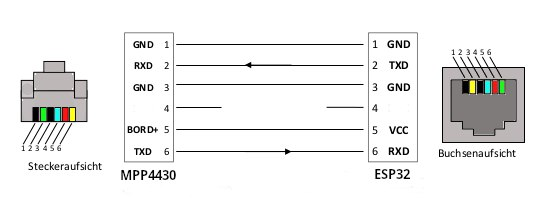
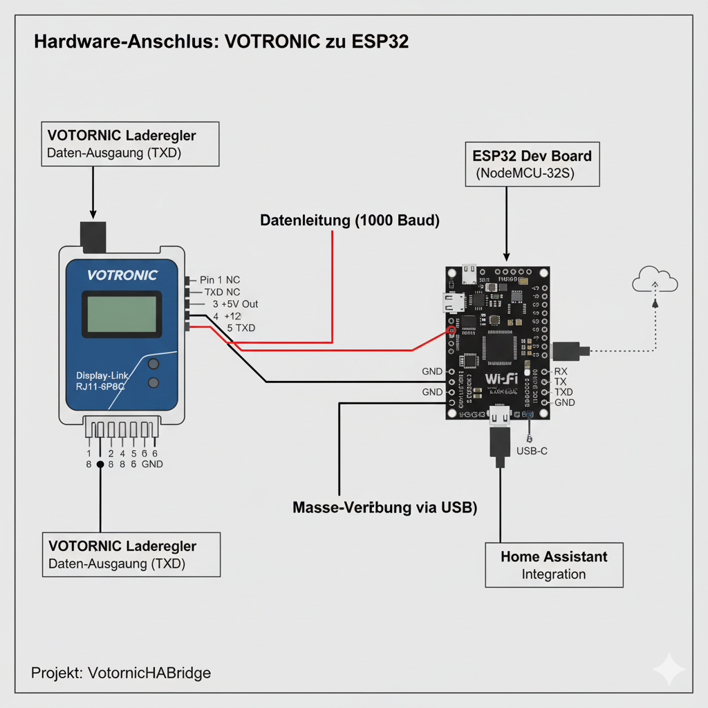

# Votronic ESPHome Custom Component
Diese ESPHome Custom Component ermöglicht das Auslesen von Daten aus Votronic-Ladereglern (z.B. MPP-Serie) über die "Display-Link"-Schnittstelle und die Übertragung an Home Assistant.

## Projekt Status 🚧
In Entwicklung! Noch nicht einsatzbereit.

Dies ist der theoretische Aufbau einer Lösung, um die Werte aus einem Votronic MPP430 auszulesen.
Mitarbeit gerne erwünscht.
Ich übernehme keine Haftung.

## Funktionen

- Liest serielle Daten mit 1000 Baud von der Votronic "Display-Link"-Schnittstelle.
- Parst das 16-Byte-Datenpaket, um Sensorwerte zu extrahieren.
- Bietet Sensoren für Bordbatteriespannung, Solarspannung und Solarstrom.
- Validiert die Checksumme der Datenpakete.

## Voraussetzungen

Spannung des MPP430 "Display-Link"-Schnittstelle an Pin 3 (+5V) und Pin 6 (GND) der RJ11-Buchse messen
Sollten 3.3 V sein
bei 5 V Logic Level Shifter verwenden zwischen TXD und RX

### Hardware

- Ein ESP32-Board mit UART-Schnittstelle.
- Ein Adapterkabel, um die RJ11-Schnittstelle des Votronic-Reglers mit dem ESP32 zu verbinden.
    - Votronic `TXD` Pin -> ESP32 `RX` Pin
    - Votronic `GND` Pin -> ESP32 `GND` Pin
  

### Software

- Eine bestehende ESPHome-Installation.
- Home Assistant mit MQTT-Broker oder Home Assistant API.

## Installation und Einrichtung

1.  Füge die beiden Ordner "components" und "packages" mit Inhalten in den esphome Ordner ein. 
3.  Passe in der`packages/votronic_device.yaml` den rx_pin und tx_pin an.
4.  Passe die `votronic-camper.yaml` Datei an deine ESP32-Hardware an.
5.  Kompiliere und lade die Firmware auf deinen ESP32.
6.  Füge die Integration in Home Assistant hinzu.
